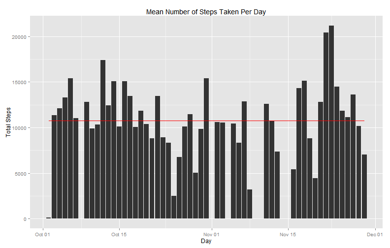
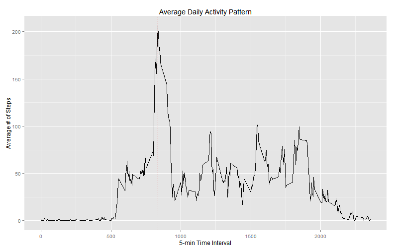
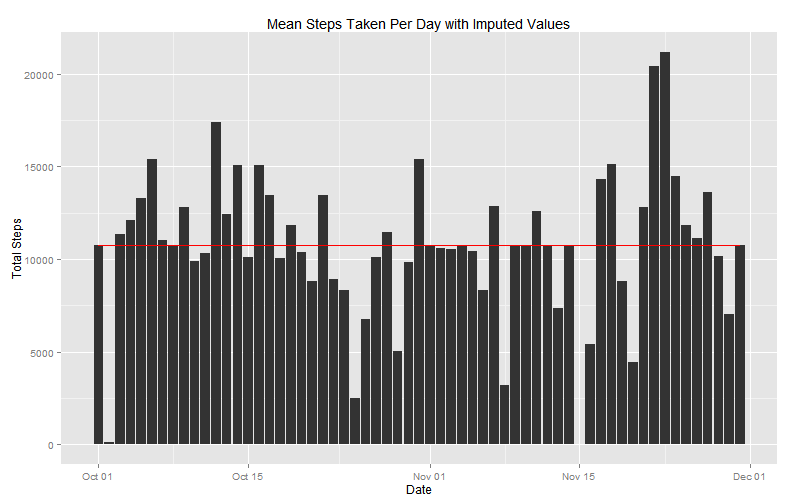
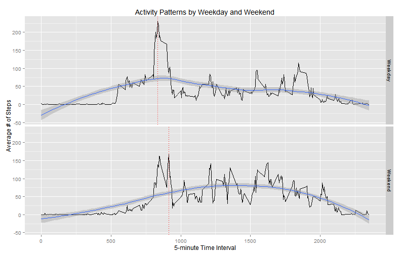

Reproducible Research Peer Assessment 1
===================================================================================

To get started, let's unzip and load our data into R.  Since I am not sure of the 
direction I am taking yet, I am also making a copy of the dataset with the NA's 
removed.  I will also load the necessary packages for the rest of the analysis.


```r
library(dplyr)
library(ggplot2)
unzip('activity.zip')
data <- read.csv("activity.csv", na.strings = "NA", header = TRUE,
                 colClasses = c("numeric", "Date", "numeric"))

data_clean <- na.omit(data)
head(data)
```

```
##   steps       date interval
## 1    NA 2012-10-01        0
## 2    NA 2012-10-01        5
## 3    NA 2012-10-01       10
## 4    NA 2012-10-01       15
## 5    NA 2012-10-01       20
## 6    NA 2012-10-01       25
```

```r
head(data_clean)
```

```
##     steps       date interval
## 289     0 2012-10-02        0
## 290     0 2012-10-02        5
## 291     0 2012-10-02       10
## 292     0 2012-10-02       15
## 293     0 2012-10-02       20
## 294     0 2012-10-02       25
```

# What is the mean total number of steps taken per day?

I am ignoring the missing values in this initial exploration of the data.  This will
need to be addressed in further exploration.

To begin, I group the data by date and sum the steps over the days 5-min intervals.


```r
total_by_day <- data_clean %>%
  group_by(date)%>%
  summarise(total_steps = sum(steps))
head(total_by_day)
```

```
## Source: local data frame [6 x 2]
## 
##         date total_steps
##       (date)       (dbl)
## 1 2012-10-02         126
## 2 2012-10-03       11352
## 3 2012-10-04       12116
## 4 2012-10-05       13294
## 5 2012-10-06       15420
## 6 2012-10-07       11015
```

Now, a histogram will succinctly show our steps per day.

```r
p1 <- ggplot(total_by_day, aes(x = date, y = total_steps)) +
  geom_histogram(stat = 'identity') +
  ylab('Total Steps') +
  xlab('Day')+
  geom_line(stat = 'hline', yintercept = 'mean', colour = 'red')+
  ggtitle("Mean Number of Steps Taken Per Day")
p1
```

 


```r
options(scipen = 3)
day_mean <- round(mean(total_by_day$total_steps), digits = 2)
day_median <- median(total_by_day$total_steps)
```

The mean number of steps per day is 10766.19.  The median number of steps per day is 10765.

# What is the average daily activity pattern?

Since I am looking at time series data this time, I first need to group the information
by 5-minute periods.  Then I am able to take the mean of each interval.

```r
avg_by_interval <- data_clean%>%
  group_by(interval)%>%
  summarise(avg_steps = round(mean(steps), digits = 2))
head(avg_by_interval)
```

```
## Source: local data frame [6 x 2]
## 
##   interval avg_steps
##      (dbl)     (dbl)
## 1        0      1.72
## 2        5      0.34
## 3       10      0.13
## 4       15      0.15
## 5       20      0.08
## 6       25      2.09
```

Now I am able to view the data graphically, looking at the average number of steps 
taken per 5 minute time interval.


```r
p2 <- ggplot(avg_by_interval, aes(x = interval, y = avg_steps)) +
  geom_line(stat = 'identity') +
  ylab('Average # of Steps') +
  xlab('5-min Time Interval')
int_max <- avg_by_interval$interval[avg_by_interval$avg_steps == max(avg_by_interval$avg_steps)]
p2 + geom_vline(xintercept = int_max, color = 'red', linetype = 'dotted') +
  ggtitle("Average Daily Activity Pattern")
```

 
This gives us a good general idea of the peak, but it is still a little tough to
eyeball an exact value.  Luckily, since I used this value to add our dashed line we
already have it stored in the value int_max. Our peak activity level occurs during
the 835 interval.

It appears our peak occurs at 8:35am.  At this point it is purely speculative, but
it seems like this might coincide with our individual getting up in the morning and 
getting ready for work/school.


# Imputing Missing Values

First, I just want to get a handle on how much missing data there is.  I can do this 
by looking at the row difference between the data and the data_clean data.frames.

```r
missing_rows <- nrow(data) - nrow(data_clean)
missing_rows
```

```
## [1] 2304
```

So we see that there are 2304 
rows(13%) with missing data.

Clearly, this needs to be dealt with.  Although there are many sophisticated strategies
for dealing with missing data, in this case I am just going to use the mean value for
the interval averaged across all days as the imputed value for that missing day and interval.

With my strategy for imputation picked, I identify missing rows and replaced the 
NA values with the mean for the interval. Note that the mean for each interval was
already calculated above in the average daily activity section.


```r
data2 <- data
interval_na <- which(is.na(data2), arr.ind = TRUE)
data2[interval_na] <- as.data.frame(avg_by_interval)[, 2]
head(data2)
```

```
##   steps       date interval
## 1  1.72 2012-10-01        0
## 2  0.34 2012-10-01        5
## 3  0.13 2012-10-01       10
## 4  0.15 2012-10-01       15
## 5  0.08 2012-10-01       20
## 6  2.09 2012-10-01       25
```

Now, let's see how our dataset has changed with this imputation strategy.

```r
total_by_day_imp <- data2 %>%
  group_by(date)%>%
  summarise(total_steps = sum(steps))

p3 <- ggplot(total_by_day_imp, aes(x = date, y = total_steps)) +
  geom_histogram(stat = 'identity') +
  ylab('Total Steps') +
  xlab('Date') +
  geom_line(stat = 'hline', yintercept = 'mean', color = 'red')
p3
```

 


```r
day_mean_imp <- round(mean(total_by_day_imp$total_steps), digits = 2)
day_median_imp <- median(total_by_day_imp$total_steps)
```

Our new mean number of steps per day is 10766.18 and our new median number of
steps per day is 10766.13.  As you can see, our imputation strategy has 
had very little effect on the dataset.  This is precisely what we are looking for in 
this situation and the strategy should be acceptable for our purposes.

# Are there differences in activity patterns between weekdays and weekends?

To determine whether there are differences in activity patterns between weekdays and
weekends we will use our dataset with missing values filled in.  The first step is 
to create a new variable labeling our data as 'weekday' or 'weekend'. Along the way, 
a new variable identifying the specific weekday will be created which can be used
later for more in depth analysis.


```r
data2$day <- weekdays(data2$date)
data2$weekend <- ifelse(data2$day %in% c("Saturday", "Sunday"), "Weekend", "Weekday")
head(data2)
```

```
##   steps       date interval    day weekend
## 1  1.72 2012-10-01        0 Monday Weekday
## 2  0.34 2012-10-01        5 Monday Weekday
## 3  0.13 2012-10-01       10 Monday Weekday
## 4  0.15 2012-10-01       15 Monday Weekday
## 5  0.08 2012-10-01       20 Monday Weekday
## 6  2.09 2012-10-01       25 Monday Weekday
```

Now our data is in a form where we can facet based on weekday/weekend.

```r
avg_by_interval_wday <- data2 %>%
  group_by(interval, weekend) %>%
  summarise(avg_steps = round(mean(steps), digits = 2))

p4 <- ggplot(avg_by_interval_wday, aes(x = interval, y = avg_steps)) +
  geom_line(stat = 'identity')+
  facet_grid(weekend ~ .) +
  ylab('Average # of Steps') +
  xlab('5-minute Time Interval')

int_max_wday <- avg_by_interval_wday %>%
  group_by(weekend) %>%
  filter(avg_steps == max(avg_steps))
p4 + geom_vline(aes(xintercept = interval), int_max_wday, color = 'red',
                linetype = 'dotted') + geom_smooth()
```

```
## geom_smooth: method="auto" and size of largest group is <1000, so using loess. Use 'method = x' to change the smoothing method.
## geom_smooth: method="auto" and size of largest group is <1000, so using loess. Use 'method = x' to change the smoothing method.
```

 
As you can see, the shape of our data is significantly different when broken down by 
weekday/weekend.  This may indicate different activity patterns during the workweek
versus the weekend.  Just glancing, we can see the peak for weekdays is earlier,
835, than weekends, 915.  This
may indicate our individual getting a later start to the day during the weekend which 
makes some intuitive sense.  This might be an avenue worth further study in a more 
detailed exploration.


